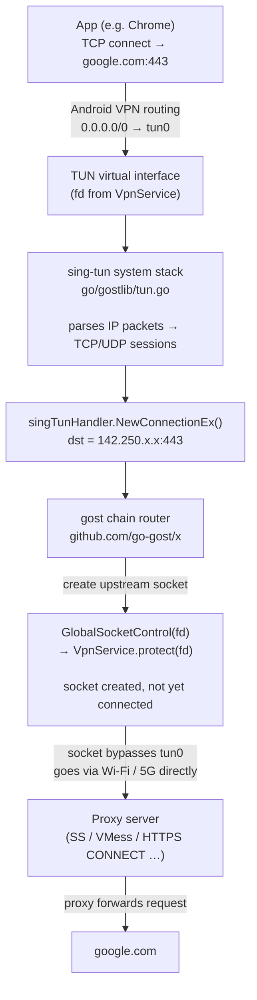
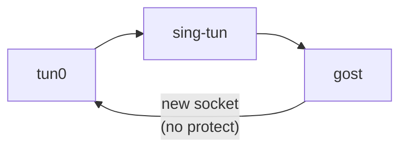
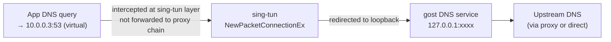

## Android VPN Data Flow

When VPN mode is active, all device traffic is routed through a TUN virtual network interface. Here is the complete path for a request to an external server (e.g. `google.com`):

### Why protect() is required

Without `protect()`, the upstream socket gost creates would also be caught by the VPN routing table and routed back into `tun0`, causing an infinite loop:

`VpnService.protect(fd)` tells Android to route that socket directly through the physical interface. It must be called **after socket creation but before `connect()`** — the only valid window. The hook is installed in gost's internal dialer so it fires automatically for every TCP and UDP upstream socket.

### DNS flow

